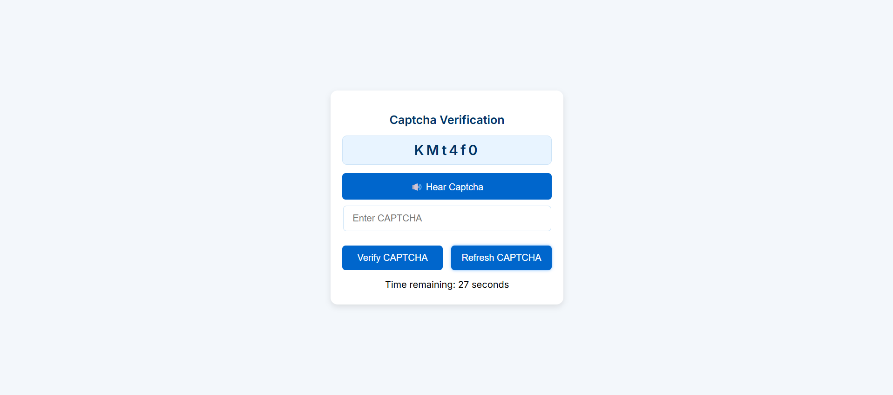

# Captcha Check

Captcha Check is a user-friendly CAPTCHA verification tool designed to improve the accessibility and security of web applications. With features like text-based and audio CAPTCHA options, along with a timer and refresh functionality, it ensures only human users can interact with your system.

## Features

- **Random CAPTCHA Generation**: Each CAPTCHA is randomly generated, consisting of letters and numbers, providing a unique challenge each time.
- **Auditory CAPTCHA**: Click to hear the CAPTCHA text, which is helpful for users with visual impairments or when text-based CAPTCHA is difficult to decipher.
- **Interactive Timer**: A countdown timer that starts as soon as the CAPTCHA is shown. The user has 30 seconds to input the correct CAPTCHA.
- **Refresh CAPTCHA**: A refresh button allows the user to get a new CAPTCHA if they’re unable to solve the existing one or the timer expires.
- **Responsive Design**: Works on both desktop and mobile devices, ensuring that users on different platforms have a seamless experience.

## How It Works

1. **CAPTCHA Generation**: When the page loads, a new random CAPTCHA text (consisting of letters and numbers) is displayed.
2. **Auditory CAPTCHA Option**: Users who prefer audio can click the "Hear Captcha" button. This reads out each character of the CAPTCHA clearly, helping users with visual impairments.
3. **CAPTCHA Input**: Users are prompted to type the CAPTCHA they see or hear into the input box provided.
4. **Verify CAPTCHA**: The entered CAPTCHA is checked against the generated CAPTCHA. A success or failure message is displayed based on the result.
5. **Timer Countdown**: The user has a limited time (30 seconds) to enter the CAPTCHA correctly. The timer shows the remaining time and disables the "Verify" button once the timer expires.
6. **Refresh CAPTCHA**: If the user needs a new CAPTCHA, they can click the "Refresh CAPTCHA" button. This generates a new CAPTCHA and resets the timer.
7. **Clear Feedback**: After verification, the tool displays whether the CAPTCHA was correct or incorrect with visually distinct messages (success or error).

## Screenshot

Here’s a screenshot showing the basic interface of the Captcha Check tool:

*Replace the above image path with the correct one from your repository.*

## How to Use

1. **Open the CAPTCHA Verification Page**: When users visit the CAPTCHA page, a new CAPTCHA is generated automatically.
2. **Option to Hear the CAPTCHA**: Click the "Hear Captcha" button to hear the CAPTCHA text audibly if you're unable to see the text clearly.
3. **Enter the CAPTCHA**: Type the CAPTCHA text you see or hear into the input field.
4. **Verify CAPTCHA**: After entering the CAPTCHA, click the "Verify" button to check if the input matches the generated CAPTCHA. A message will indicate whether the CAPTCHA was correct.
5. **Timer Countdown**: Be mindful of the countdown timer. You have 30 seconds to complete the CAPTCHA. The timer will reset once you refresh the CAPTCHA.
6. **Refresh CAPTCHA**: If you run out of time or want to try again, click the "Refresh CAPTCHA" button to generate a new CAPTCHA.

## Technologies Used

- **HTML**: Structure and layout of the CAPTCHA page.
- **CSS**: Styling and responsive design to ensure a seamless user experience across different screen sizes.
- **JavaScript**: Handles CAPTCHA generation, verification, speech synthesis, and timer functionality.
- **Web Speech API**: Used for generating the auditory CAPTCHA feature for accessibility.

## Contributing

If you want to improve Captcha Check or add new features, please feel free to fork this project and submit a pull request. We appreciate contributions, whether it’s fixing bugs, adding features, or improving documentation.

### How to Contribute:

1. Fork the repository.
2. Create a new branch for your feature or bug fix.
3. Make your changes and test them locally.
4. Commit your changes with a clear message about what you did.
5. Open a pull request to merge your changes into the main repository.

---

Thank you for checking out Captcha Check! Feel free to test the CAPTCHA and contribute to the project. If you have any questions or suggestions, please open an issue in the GitHub repository.

